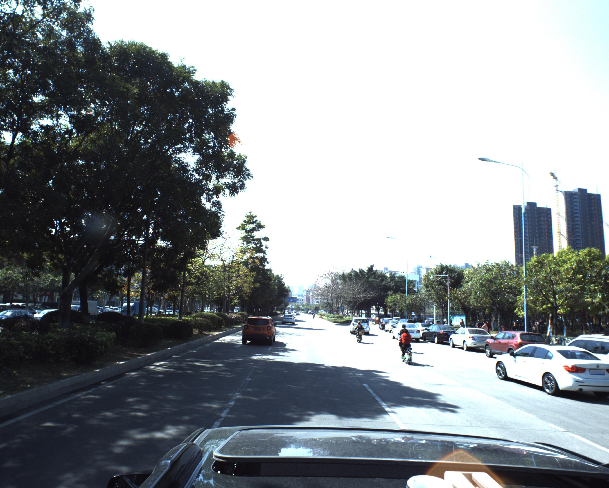
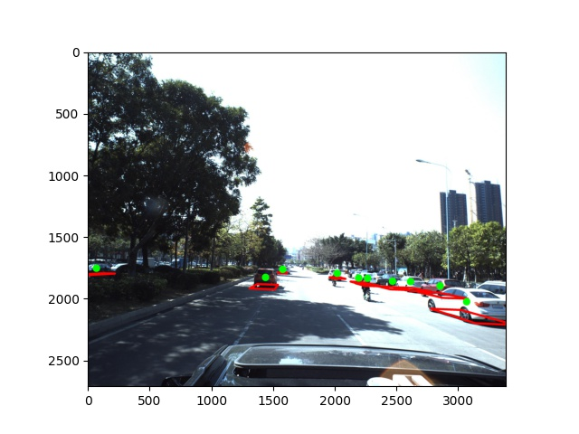

# Purpose
The Car Pose Machine Learning (ML) tool ingests a single static image and returns the 3D position and orientation of all cars in that image relative to the camera.

# Example
Uploaded Image:



Return Image:



# Usage
The tool can be invoked with API tools such as curl and Postman or via a Python utility script.

The API endpoint is https://uru0x7k769.execute-api.us-west-1.amazonaws.com/test/carlambda.

Images should be included in the body of the API request in the .jpg format using form-data and `key: pic`.

An example Python utility script is shown below (Postman can generate these in other programming languages as well):

```
import requests
import base64

url = "https://uru0x7k769.execute-api.us-west-1.amazonaws.com/test/carlambda"

upload_filename = './ID_00ab59fa6.jpg'
payload={}
files=[
  ('pic',(upload_filename,open(upload_filename,'rb'),'image/jpeg'))
]
headers = {}

response = requests.request("POST", url, headers=headers, data=payload, files=files)
body_dec = base64.b64decode(response.text)

response_filename = 'response_img.jpg'  
with open(response_filename, 'wb') as f:
    f.write(body_dec)
```
# Overview of AWS Architecture
https://docs.google.com/document/d/1heGLAFoLxrate8IH2vbBKmtD837zXByZVmlDCNIp0PE/edit?usp=sharing

# AWS Build Instructions
* Start with a new implementation of the [AWS Default VPC](https://docs.aws.amazon.com/vpc/latest/userguide/default-vpc.html#create-default-vpc)
* Create a new [AWS Elastic File System](https://docs.aws.amazon.com/efs/latest/ug/gs-step-two-create-efs-resources.html)
* Mount the EFS to an [EC2 instance](https://docs.aws.amazon.com/efs/latest/ug/mounting-fs-mount-helper.html)
* [Install the Python packages](https://aws.amazon.com/blogs/aws/new-a-shared-file-system-for-your-lambda-functions/) listed in requirements.txt in the mounted EFS
* Save final_model.pt in the EFS
* Create a new Lambda function using car-processor2.yaml and lambda_function.py
* Mount the EFS
* Deploy the Lambda function
* Create a new trigger for an [AWS API Gateway](https://docs.aws.amazon.com/lambda/latest/dg/services-apigateway.html)
* Deploy the API Gateway and [enable CORS](https://docs.aws.amazon.com/apigateway/latest/developerguide/how-to-cors.html)
* Use the API endpoint to send requests to the Lambda function with the usage instructions above  

# Future Work
* Include a list of car poses in the API response
* Include an option in the API response to receive additional images such as X,Y,Z projections
* Return a 3D model of the scene in the image
* Allow users to specify the camera parameters of their uploaded image