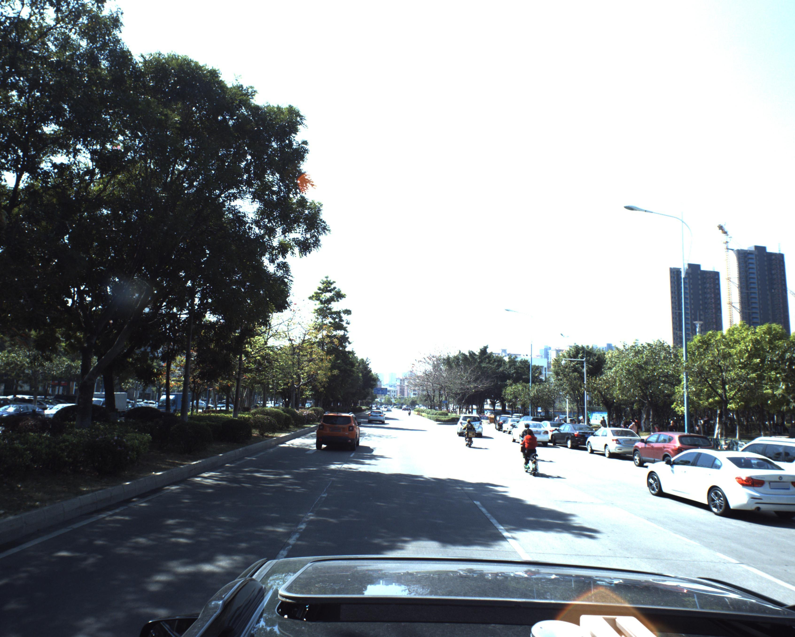
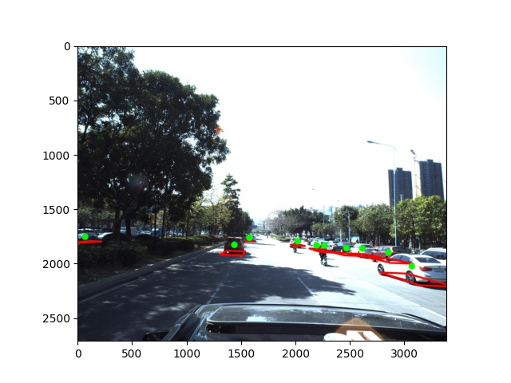

# Purpose
The Car Pose Machine Learning (ML) tool ingests a single static image and returns the 3D position and orientation of all cars in that image relative to the camera.

# Example
Uploaded Image:



Return Image:



# Usage
The tool can be invoked with API tools such as curl and Postman or via a Python utility script.

The API endpoint is https://uru0x7k769.execute-api.us-west-1.amazonaws.com/test/carlambda.

Images should be included in the body of the API request in the .jpg format using form-data and `key: pic`.

An example Python utility script is shown below (Postman can generate these in other programming languages as well):

```
import requests
import base64

url = "https://uru0x7k769.execute-api.us-west-1.amazonaws.com/test/carlambda"

upload_filename = './ID_00ab59fa6.jpg'
payload={}
files=[
  ('pic',(upload_filename,open(upload_filename,'rb'),'image/jpeg'))
]
headers = {}

response = requests.request("POST", url, headers=headers, data=payload, files=files)
body_dec = base64.b64decode(response.text)

response_filename = 'response_img.jpg'  
with open(response_filename, 'wb') as f:
    f.write(body_dec)
```

# Data Collection
Describes how to gather and load the training and test data.

# Data Wrangling and Prototype
Performs exploratory data analysis and assembles a prototype deep learning solution.

# Production (Local)
Refactors the protype solution into a working command line function.

# Production (Deployed)
Builds a serverless workflow on Amazon Web Services (AWS) to host the tool and manage API requests.
